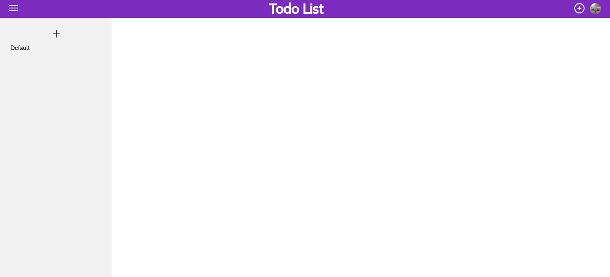
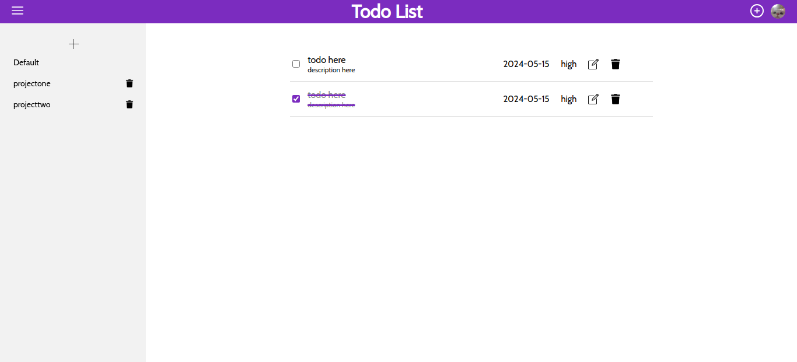

# Todo List

This is a todo list project. It lets you add, create, delete, and edit todos. Todos are made inside of a project (basically a list or category for your todos). There is a default project in which all your todos will be placed in. You may create new projects and delete them but you cannot delete the default project. If you delete a project that has todos inside of it, all of them will be moved to the default project.

All your todos and projects will be saved in local storage, this means that any todos you have made/edited will still be there if you refresh the page or close and reopen it, and the same goes for your projects! Pretty cool if you ask me :D.

## Live preview

You can see the live preview [here](https://lost-stardust.github.io/Todo-list/)

## Screenshots

